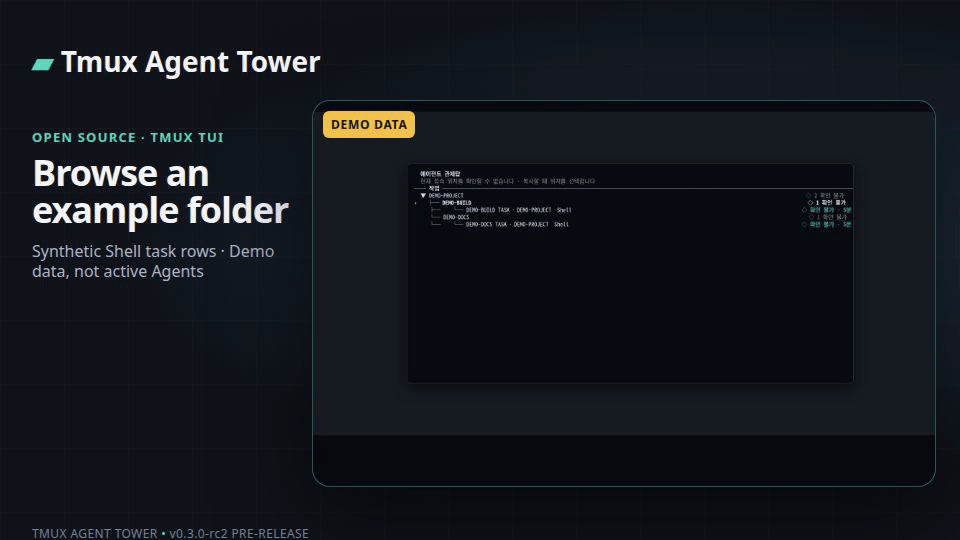

# Tmux Agent Tower

**[English](README.md) | 한국어**

tmux 코딩 Agent를 한눈에 살펴보세요. 확인이 필요한 작업을 찾고 로컬이나 SSH
환경에서 작업을 시작할 수 있습니다.



> 데모 데이터: 합성 Shell 작업 행입니다. 실제 Agent 실행이나 검증된 Result가 아닙니다.

[v0.3.0-rc2 사전 공개 버전 보기](https://github.com/ju0o/tmux-agent-tower/releases/tag/v0.3.0-rc2) · [설치](#설치)

## 빠른 시작

1. 아래 설치 안내에 따라 Tower를 설치합니다.
2. tmux 안에서 `tower`를 실행합니다.
3. `+`를 누르고 실행 환경 선택 화면이 나오면 환경을 고른 뒤 프로젝트와 Agent를 선택합니다.

## Tower로 할 수 있는 일

- 여러 tmux pane의 작업과 확인 필요 항목을 봅니다.
- 로컬이나 설정한 SSH 환경에서 작업을 시작합니다.
- Result 복사는 Agent별 Provider 증거에 따라 달라집니다. 격리 시험 1회에서 Tower v0.3.0-rc2와 Codex CLI 0.161.0 조합은 native 원문 전체를 반환하지 않았습니다.

## 지원 Agent와 제한사항

인식하는 CLI: Codex, Claude Code, OpenCode, Grok CLI, Cursor Agent CLI.
Cline native 전체 Result 복사는 지원하지 않으며, 그 밖의 명령은 일반 Shell/SSH
폴백으로 표시됩니다.

상태 감지는 최선-추정이며 Agent CLI가 바뀌면 달라질 수 있습니다. Result 복사는
완료된 Turn을 확인할 수 있을 때만 가능하며 Agent, SSH 구성, 터미널, 클립보드에
따라 동작이 달라집니다. 일반 원격 작업 개요에는 원격 pane 전체 내용이 없습니다.
v0.3.0-rc2는 정식 버전이 아닌 RC입니다.
[제한사항](#제한사항)을 확인하세요.

[설치](#설치) · [문서](docs/STATUS_ENGINE.md) · [기여하기](CONTRIBUTING.md) · [이슈 제보](https://github.com/ju0o/tmux-agent-tower/issues)

Codex, Claude Code, OpenCode, Grok CLI, Cursor Agent CLI를 여러 tmux pane에서
(때로는 여러 대의 컴퓨터에 걸쳐) 동시에 쓰다 보면, 어떤 게 아직 작업 중인지,
어떤 게 승인을 기다리며 멈춰 있는지, 어떤 게 10분 전에 이미 끝났는지 놓치기
쉽습니다. Tmux Agent Tower는 이걸 한 화면에 모아 보여주고, 필요한 pane으로
바로 이동시켜주는 작고 local-first인 TUI입니다.

## 이 도구는 이런 것입니다 (그리고 이런 것은 아닙니다)

* **Local-first**: 서버도, 계정도, 클라우드 백엔드도 없습니다. 사용자 본인의
  tmux 서버(그리고 선택적으로, 본인이 이미 맺어둔 SSH 연결을 통한 두 번째
  호스트)를 읽어서 보여줄 뿐입니다.
* **지켜보는 동안에는 입력하지 않음**: pane을 보기만 할 때는 그 안에
  글자를 넣지 않습니다. prompt, 승인 키, 이름 변경, 닫기는 직접 고른
  뒤에만 실행되고, 대상은 tmux host의 pane id입니다. 화면에 묶인 Host
  이름을 따라가지 않고, Agent 인증정보도 건드리지 않습니다.
* **최선-추정(best-effort) 상태**이지 보장이 아닙니다. 상태는 각 Agent의
  내부 API가 아니라(대부분 그런 걸 제공하지 않습니다) 터미널 출력 패턴과
  프로세스 활동으로 추정합니다. Agent CLI의 새 버전이 나오면 UI가 바뀌어서
  해당 Agent의 감지가 깨질 수 있습니다 -- [`docs/STATUS_ENGINE.md`](docs/STATUS_ENGINE.md) 참고.

## 기능

* 작업 묶음은 관련 작업을 함께 보여줍니다. 접힌 묶음에는 진행 중·확인 필요·새
  결과 개수가 표시되고, 묶이지 않은 작업은 독립 항목으로 남습니다. 작업 행에는
  역할, Agent, 상태를 먼저 표시합니다.
* 선택한 작업 요약에는 작업 이름, Agent, 역할, 상태, 프로젝트, 실행 위치를
  표시합니다. 터미널 내부 식별자는 고급 터미널 보기에서 확인할 수 있습니다.
* Agent pane을 열면 실시간 화면과 입력칸이 함께 있는 상세 화면이 계속 열려
  있습니다. `메시지`를 입력하고 Enter로 보낸 뒤 바로 다음 메시지를 이어서
  입력할 수 있습니다. Shell pane은 `명령 입력`, Agent의 질문에는 `답변`으로
  표시합니다. Ctrl+O로 직접 줄을 바꾸고 Enter로 보냅니다. 여러 줄 붙여넣기,
  CRLF/LF 줄바꿈과 32,000자 제한을 지원하며, 다른 작업으로 이동해도 초안을
  작업별로 보존합니다.
  승인·선택은 화면에서 확인된 항목만 표시하고, 확인할 수 없는 상호작용에는
  추측한 응답 키를 제공하지 않습니다. 상세 화면에서 Ctrl+Y는 Tower가 완료로
  판정한 최신 Result 복사를 요청합니다. Agent Provider가 전체 Turn을 확인하지
  못하면 복사할 수 없으며, 일부 버전의 동작은 제한사항을 확인하세요. 결과 표시는
  Ctrl+S이며, Esc는 목록으로 돌아갑니다.
  `Ctrl+I`로 고급 동작을 열고 `Ctrl+L`을 누르면 현재 화면만 별도로 복사합니다.
* `L`을 누르면 선택한 작업이나 작업 묶음의 LIVE 화면을 바로 엽니다. 작업은
  집중 보기, 묶음은 저장된 집중·좌우 2분할·2×2·메인+사이드 배치를 사용합니다.
  표시할 작업이 4개보다 많으면 작은 칸에 억지로 넣지 않고 다음 페이지로
  이동합니다. 아무 작업도 선택하지 않았으면 배치와 작업을 고릅니다.
  `Enter`는 선택한 작업의 대화를 열고, `Y`는 Tower가 완료로 표시한 최신 Result를
  요청합니다(아래 제한사항 참고). `Space`는 기존 작업 메뉴, `G`는 실제 터미널로 이동합니다. PageUp/PageDown은
  출력을 이동하고 Home은 최신 화면으로 돌아옵니다. 터미널이 작거나 좁으면
  한 작업씩 표시합니다. 원격·종료·신원 변경 작업의 이전 출력은 재사용하지
  않습니다. LIVE는 읽기 전용 `capture-pane`을 사용하며 실제 tmux 배치를
  바꾸지 않습니다. 격리 tmux에서 네 배치와 42×14부터 160×45까지를 실행해
  확인했습니다.
* `/`는 검색·명령 팔레트를 엽니다. 작업·작업 묶음·프로젝트·Agent 이름·폴더·화면을
  검색하거나 새 작업, SSH 환경 추가·보기, 실시간 보기, 저장한 구성, 템플릿, 설정,
  고급 작업 흐름 명령을 실행할 수 있습니다. `↑`/`↓`로 이동하고 `Enter`로 열며,
  `Esc`로 닫습니다.
* 프로젝트 이름은 실제 우선순위 체계로 자동 감지합니다: 직접 지정한 이름 →
  git 저장소 이름 → 의미 있는 pane 제목 → 디렉터리 이름 순이며, 의미 없는
  한 글자짜리나 마운트 포인트 같은 이름(`f`, `mnt` 등)은 더 나은 대안이
  있으면 그대로 보여주지 않습니다.
* 작업 중·확인 필요·새 결과는 작업 묶음 요약과 작업 상태에 표시합니다.
  실행 상태, 사용자 확인 필요, 완료 결과는 서로 다른 정보로 관리합니다.
* SSH로 연결된 두 번째 호스트도 함께 보여주며, 연결이 안 되면 `확인 불가`/오프라인으로
  안전하게 표시됩니다 -- 로컬 TUI는 그것 때문에 멈추지 않습니다.
* pane마다 한 줄짜리 **현재 작업** 추정치를 보여줍니다(예: `Calling
  some_tool...`, `~ Preparing write...`) -- 이미 캡처된 터미널 텍스트에서만
  뽑아내며, LLM 호출도 없고 외부로 나가는 것도 없습니다. 원본 터미널
  내용은 디스크에 저장하지 않습니다. 근거가 확실할 때만 보여주고,
  애매하면 그냥 숨깁니다.
* **상태 지속시간**: Tower가 이 pane을 현재 상태로 계속 관찰해 온 시간을
  보여줍니다(`대기 · 4m`), 상태 옆과 상세정보 패널에 함께 표시됩니다.
* 고급 터미널 보기에는 기존 주의 필요 탐색도 남아 있습니다. 기본 화면은
  작업 묶음과 작업을 중심으로 상태와 확인 필요 항목을 보여줍니다.
* 기본적으로 꺼져 있는 알림 기능: 상태가 실제로 바뀔 때(예: Agent가 입력을
  기다리기 시작할 때) `notify-send` 또는(데스크톱 알림이 없는 환경이면)
  `tmux display-message`로 한 번만 알려줍니다 -- 같은 상태가 계속돼도
  반복해서 알리지 않습니다.

## 설치

Python 3.9+, tmux, curses를 지원하는 터미널(`TERM`)이 필요합니다(일반적인
터미널이면 다 됩니다).

```bash
git clone https://github.com/ju0o/tmux-agent-tower
cd tmux-agent-tower
./scripts/install.sh
```

설치 스크립트는:

* 사용자 계정에 `tower` 명령을 설치합니다(`pip install --user -e .`, 또는
  `--user` 설치가 막혀 있는 환경(PEP 668)이면 가상환경에 설치),
* `~/.bashrc`에 한 줄만 추가합니다(이미 있으면 건너뜁니다),
* 손대는 dotfile은 먼저 백업합니다(`<파일>.bak.<타임스탬프>`),
* `~/.tmux.conf`는 건드리지 않고, tmux 키도 기본적으로 재바인딩하지
  않습니다 -- 아래 "선택사항: `Ctrl+b w` 단축키" 참고.

설치한 걸 되돌리려면 `./scripts/uninstall.sh`를 실행하세요(뭘 되돌릴지 먼저
알려줍니다).

## 사용법

tmux pane 안 어디서든:

```
tower
```

를 치면 바로 그 pane에서 TUI가 실행됩니다. 휴대폰에서 보려면
`M` → **휴대폰 원격 시작**이면 됩니다. 셸 명령은 필요 없습니다. 나중에
다른 pane에서 또 하나 띄우면 그게 "현재 활성" Tower가 됩니다 -- 기존
것들도 안 죽고 계속
실행되지만, 아래의 `tower --focus`는 가장 최근 것으로 이동합니다.

Tower는 자신이 실행 중인 pane을 그 tmux 세션이 유지되는 동안 기억합니다
(창 이름이나 위치가 아니라 pane id 기준이라, 창 이름이 바뀌거나 다른
용도로 재사용돼도 헷갈리지 않습니다). 같은 세션의 다른 어디서든:

```
tower --focus
```

를 치면 새로 띄우지 않고 그 Tower로 바로 이동합니다. 아래의 선택적
`Ctrl+b w` 단축키가 하는 일이 바로 이것입니다 -- 또 다른 TUI를 띄우는 게
아니라 단순 이동 명령이라서 키에 바인딩해도 안전합니다.

현재 기기를 복사 위치로 유지한 채 다른 SSH 호스트의 Tower를 열려면:

```bash
tower connect work-server
```

기존 OpenSSH 설정 alias나 주소를 사용합니다. 원격 호스트에 실행 중인
Tower가 하나 있어야 합니다. 연결기는 `ssh -G` 설정을 따르며, 중첩
SSH에서도 처음 접속한 Access Client 정보를 유지합니다. Tower가 여러 개면
`--session`으로 선택합니다.

기본 화면은 **폴더 → 작업 화면 → 작업** 목록입니다. `+`에서 폴더를 만들고,
작업 화면 메뉴의 **폴더로 이동**으로 정리할 수 있습니다. 폴더와 작업 화면의
이름·순서·접기 상태는 Tower에 저장되며 실제 tmux 배치에는 영향을 주지 않습니다.
폴더에 넣지 않은 작업 화면은 **기타**에 표시됩니다. 작업 묶음은 Agent 팀을
나타내는 별도 개념으로 계속 사용할 수 있습니다. 터미널 구조는 **더보기 →
터미널 구조 보기**에서 확인합니다.

| 키 | 동작 |
|---|---|
| `↑` / `↓` (또는 `j`/`k`) | 이동 |
| `Enter` | 폴더/작업 화면 접기·펼치기, 또는 선택한 작업 열기 |
| `Space` | 폴더, 작업 화면, 작업의 메뉴 |
| `+` | 실행 환경 → 프로젝트 → Agent 순서로 새 작업 시작 |
| `S` | **저장한 구성**과 **템플릿** 열기 |
| `L` | 실시간 보기. 작업 묶음을 선택했으면 묶음 전체를 엽니다 |
| `C` | 설정 |
| `/` | 작업·폴더·화면·Agent를 찾거나 명령 실행 |
| `Y` | Tower가 완료로 판정한 최신 Result 복사 요청 (Agent별 차이는 제한사항 참고) |
| `G` | 선택한 작업의 실제 터미널 열기 |
| `Esc` | 한 단계 뒤로 |
| `?` | 기본 도움말 |
| `Ctrl+C` | Tower 종료 |

로컬 작업에서 `Enter`를 누르면 실시간 화면과 입력창이 함께 있는 상세 화면을
엽니다. 메시지를 보내도 상세 화면은 유지되고 입력창이 다음 메시지를 받을
준비를 합니다. 여러 줄 한국어와 코드 블록도 그대로 붙여넣을 수 있습니다.
Agent는 `메시지`, 셸은 `명령 입력`, 확인된 텍스트 질문은 `답변`으로 표시합니다.
확인된 승인이나 선택이 나타나면 입력창 자리에 해당 선택지만 표시하고,
확인할 수 없는 상호작용에는 입력을 보내지 않습니다. `Esc`로 목록으로 돌아갑니다.

### 작업 이름과 고급 정보

기본 화면의 이름은 **작업 이름** 하나입니다. 비워 두면 프로젝트와 역할을
바탕으로 자동 추천하고, 역할이 없으면 Agent를 사용합니다(예: `ExampleProject · 구현`,
`ExampleProject · Codex`). 작업 메뉴의 **이름 바꾸기** 또는 휴대폰의 **이름 바꾸기**로 지정한 이름은
새로고침 후에도 유지됩니다. 같은 이름의 작업도 허용됩니다.

작업 메뉴의 **작업 설정**에는 이름 바꾸기, Agent 변경, 역할 변경, 프로젝트 변경이
있습니다. 작업 옮기기와 배치 바꾸기는 별도 항목입니다. 프로젝트는 작업이 연결된 프로젝트와 경로를
뜻합니다. 프로젝트를 바꿔도 작업 이름은 유지됩니다. Agent나 역할을 바꾸면
자동 추천 이름만 다시 계산하며, 직접 지정한 작업 이름은 바꾸지 않습니다.

실제 터미널 화면 이름, 경로, 실행 위치, tmux 위치와 ID는 기본 이름과 분리된
고급 정보입니다. Pane/Window 용어와 이름 변경은 작업 편집의 기본 항목에
나오지 않습니다. 휴대폰도 PC와 같은 작업 이름을 표시합니다.

기본 목록은 **폴더 → 작업 화면 → 작업** 구조입니다. 폴더와 작업 화면은 Tower의
논리적인 정리 이름이며, tmux session/window/pane을 만들거나 옮기는 작업이 아닙니다.
폴더 이름·순서·접기 상태와 작업 화면 이름·순서는 재시작 뒤에도 유지됩니다.
폴더에 속하지 않은 작업 화면은 **기타**에 표시됩니다. 기존의 **작업 묶음**은
여러 Agent 작업이 함께 맡는 목표를 나타내며, 폴더와 별도로 유지됩니다.

작업 묶음은 논리적인 목록과 상태 요약입니다. 작업을 묶거나 빼거나 묶음을
해제해도 tmux pane/window는 이동·이름 변경·종료되지 않습니다. 그룹 이름,
멤버십, 순서는 Tower 재시작 뒤에도 유지되고 휴대폰 목록에도 같은 순서로
표시됩니다.

### 새 작업 만들기와 옮기기

`+`의 **새 작업**은 선택 입력인 작업 이름, 실행 컴퓨터, 프로젝트, Agent, 역할,
배치를 차례로 묻습니다. 작업 이름을 비워 두면 자동 추천을 사용합니다. Agent는 Codex·Claude 같은 실행 프로그램이고 역할은
그 작업에서 맡는 설명용 구분입니다. 기본 역할은 조율, 계획, 구현, 검수,
확인, 실사용, 전체 흐름이며 역할 없음도 선택할 수 있습니다. 역할은 명령이나
Agent 신원을 바꾸지 않습니다. 일반 목록은 프로젝트·작업 이름과 지정 역할을
함께 보여주고, 상세 정보에도 역할을 따로 표시합니다. 기존 작업은 **작업 설정**에서
조정할 수 있습니다.

배치는 **새 작업 묶음** 또는 **현재 작업 옆**입니다. 좁은 화면에서는 작업 이름과
역할을 별도 줄에 표시하고 Agent와 상태도 읽을 수 있게 유지합니다.
**작업 옮기기**는 작업 묶음 소속만 바꿉니다. 실행 중인 pane, Agent, 프로젝트,
초안과 결과는 그대로 둡니다. 그룹 안의 순서와 Tower 보기 배치도 실제 터미널
배치와 별도로 저장합니다. 실제 터미널에서 옮기거나 배치를 적용하는 동작은 별도
메뉴에서 확인을 거치며, Tower가 만든 것으로 확인된 pane만 대상입니다. 대상 화면에
사용자 pane이 섞였거나 실행 위치가 다르면 변경하지 않습니다. 휴대폰에서는 논리적인
작업 묶음·순서·보기 배치만 바꿀 수 있습니다.

격리 tmux에서 논리 이동, Tower 소유 pane의 실제 이동/분리, pane PID 유지,
Result identity 갱신, 무관 pane 보존을 확인했습니다. 실제 Agent가 끝낸 결과를
이동 후 재추출하는 검증은 이 fixture에 포함되지 않았습니다.

### 여러 프로젝트 작업 만들기 (고급)

먼저 어디서 작업할지 고릅니다. 그 호스트의 작업공간 브라우저에서 최근
경로, 설정된 루트 안의 검색, 폴더 트리, 직접 입력 중 하나를 고릅니다.
모든 항목에 실제 경로가 보이고, git 저장소가 아닌 일반 폴더도 열 수
있습니다. 폴더 탐색은 트리입니다. 한 줄을 펼칠 때만 그 폴더를 읽고, 위쪽
폴더는 화면에 남습니다. Enter는 펼치기이고, Space가 작업공간 선택입니다. 그 다음 에이전트,
배치와 레이아웃을 고르고
생성합니다. 이 흐름은 고급 만들기 메뉴에 있습니다. 기본 `+`는 실행 환경,
프로젝트, Agent 세 단계로 새 작업을 시작합니다. 기존 `N`과 `W` 키는
고급 만들기 메뉴를 엽니다.
원격 호스트도 같은 화면입니다. 목록, 경로 확인, 검색은 읽기 전용 SSH이고
디렉터리 하나씩 가져오며, 원격에 Tower를 설치하지 않습니다. tmux 작업은
생성을 확인한 뒤에만 실행됩니다. 새 pane은 고른 경로로 이동하고, 고른
에이전트를 실행한 뒤 Tower에 표시됩니다.

이건 이미 돌아가고 있는 Agent를 조작하는 것과는 분명히 다릅니다: 이
launcher는 항상 새 pane만 만들 뿐, 실행 전부터 있던 어떤 것에도 입력을
보내거나, 닫거나, 재구성하지 않습니다 -- 이 구분이 왜 중요한지, 그리고
아직 의도적으로 만들지 않은 것("Action Layer")이 무엇인지는
[`docs/ROADMAP.md`](docs/ROADMAP.md)를 참고하세요.

프로젝트 검색 위치는 `~/.config/tmux-agent-tower/config.toml`에서 옵니다:

```toml
project_roots = ["~/Projects", "~/code"]

[agents]
claude = "claude-beta"   # 에이전트 실행에 쓸 명령어를 직접 지정
```

둘 다 선택사항입니다 -- 설정이 전혀 없으면 launcher는 홈 폴더 아래에 실제로
있는 흔한 디렉터리 이름들(`Projects`, `code`, `dev`, `src` 등)을 찾고, 각
에이전트는 기본 명령어 이름을 씁니다. 실행 직전에 `command -v`로 명령어가
있는지 확인합니다(로컬 실행이면 로컬에서, 원격 실행이면 대상 호스트에서);
없으면 그 프로젝트의 pane만 "명령을 찾을 수 없음" 제목이 붙은 빈 셸로
열리고, 나머지는 정상적으로 진행됩니다.

### 저장한 구성과 템플릿

작업 묶음 메뉴의 **저장하기**에서 현재 구성을 두 방식으로 저장합니다.
**저장한 구성**은 전에 하던 프로젝트와 Agent 구성을 다시 엽니다.
**템플릿**은 Agent/역할 구조를 다른 프로젝트에 재사용합니다. 템플릿은 프로젝트 경로와 개인 실행
컴퓨터를 빼고 역할·기본 Agent·순서·논리 레이아웃만 저장하므로 다른
프로젝트에 적용할 수 있습니다.

`S`에서 **저장한 구성**과 **템플릿**을 열면
한 화면 안에 나옵니다. 항목을 고르고 실행 전 미리보기를 확인합니다. 템플릿은
프로젝트 경로와 각 역할의 Agent를 바꿀 수 있습니다. Agent나 경로를 사용할 수 없으면 시작하지 않으며, 기존 pane을
건드리지 않습니다. 실행 결과는 새 작업 묶음입니다. 템플릿은 실제 pane이나
window ID를 저장하지 않습니다.

구성은 `~/.config/tmux-agent-tower/worksets.json`에 로컬 원자 기록됩니다.
저장 파일은 사용자만 읽도록 제한하고, 손상되거나 더 새로운 형식이면 원본을
덮어쓰지 않습니다. 휴대폰 목록에는 경로와 실행 호스트를 보내지 않습니다.
휴대폰에서도 저장한 구성과 템플릿을 선택하고, 프로젝트 경로와 Agent를
확인한 뒤 실행할 수 있습니다.

이전 `workspace-presets.json`은 기존 Workflow 연결과 호환성을 위해 보존됩니다.
새 저장된 작업과 템플릿은 별도의 Work Group 기반 구성을 사용합니다.

### 작업 순서

**고급 설정 → 작업 흐름**에서 기존 저장 구성과 실행 순서를 따로 고른 뒤
확인하면 단계별 실행을 만듭니다. 저장 구성은 실행 환경·경로·사용 가능한
Agent를 정하고, Workflow preset은 역할의 순서만 정합니다. 둘의 저장 모델은
Work Group 기반의 저장된 작업/템플릿과 분리되어 있습니다.

기본 순서는 빠른 수정(구현 → 확인 → 사람 확인), 기능 개발(계획 → 구현 → 검수 →
확인), 집중 고도화(조율 → 계획 → 구현 → 확인 → 실사용 → 전체 흐름 → 사람 확인)입니다.
미리보기에는 한국어 단계 이름과 사람 확인 단계가 표시됩니다. 미리보기와 실행 만들기는
Agent에게 내용을 보내지 않습니다.

사용자 작업 순서는 `~/.config/tmux-agent-tower/workflow-presets.json`에 JSON으로
추가할 수 있습니다. `version`은 `1`, 각 항목은 중복되지 않는 영문 소문자 ID, 고유한
이름, 알려진 역할 ID로 된 `stages` 목록만 가집니다. `human_gate`를 단계 목록에 한 번
넣을 수 있습니다. 예:

```json
{
  "version": 1,
  "workflows": [
    {"id": "review-first", "name": "검토 후 구현", "stages": ["reviewer", "builder", "qa", "human_gate"]}
  ]
}
```

파일은 64 KiB까지이며 알 수 없는 필드, 중복 ID·이름·단계, 미지원 역할은 거부됩니다.
파일 내용은 JSON 데이터로만 읽고 가져오거나 평가하거나 실행하지 않습니다. 잘못된 파일은
사용자 작업 순서에서 제외하고 한국어 오류를 표시합니다.

실행 상태는 `~/.cache/tmux-agent-tower/workflow-runs.json`에 원자적으로
저장됩니다. 실행 ID, Workspace/Workflow 스냅샷, 단계 순서와 상태, 시각,
재개 확인에 필요한 pane key·session·pane PID, 선택한 provider와 작업 표시명을
보관합니다. Harness, brief, 결과 본문, 대화 내용, 명령, 자격 증명은 저장하지
않습니다. 재시작하면 저장된 실행을 다시 열 수 있습니다. 기존 pane이 사라졌거나
신원이 바뀌면 다른 pane으로 옮기지 않고 수동 결과 기록 또는 명시적 재시도를
요구합니다.

각 단계는 `PENDING`, `RUNNING`, `PASS`, `FAIL`, `BLOCKED` 중 하나입니다.
Agent 단계는 사용자가 **다음 단계 시작**을 고른 뒤 역할 Harness를 읽고
미리봅니다. 그 다음 선택한 Workspace 안에서 Host·경로·실제 provider가 맞는
기존 로컬 pane을 고르고 brief를 작성합니다. 마지막 **선택한 작업에 보내기**를
확인해야 기존 안전한 prompt 입력 경로가 선택 pane의 key·session·PID·Host·경로를
다시 검사하고 한 번 전송합니다. Approval, 입력 질문, 알 수 없는 상호작용,
Shell pane, 원격 pane은 대상에서 제외됩니다. 실제 provider/TUI 사용 검증은
`HUMAN_GATE_PENDING`입니다.

현재 safe input 경로에는 원격 pane 전송이 없습니다. 원격 Workspace에서 Agent
단계를 선택하면 그 단계는 `PENDING`으로 남고 로컬 전송 경로가 없음을 안내합니다.
SSH를 통한 명령 실행이나 원격 입력을 대신 시도하지 않습니다.

전송 후에도 PASS는 자동 판정하지 않습니다. 사용자가 현재 단계를 검토해 PASS,
FAIL 또는 BLOCKED를 기록해야 합니다. 다음 단계는 별도의 **다음 단계 시작**을
눌러야 열립니다. 실패/차단 단계는 명시적으로 다시 시도하기 전까지 멈춥니다.
사람 확인 단계에는 provider, pane, Harness, prompt가 없으며 시작과 결과를
사람이 각각 기록합니다. Agent 간 자동 전달은 없습니다.

### 역할별 안내문

각 Tower 역할에는 기본 Markdown 안내문이 있습니다. `load_harness(role_id)`는
같은 역할 ID에 대해 Agent/provider 종류와 관계없이 같은 기본 내용을 읽으며,
`~/.config/tmux-agent-tower/harnesses/<role>.md`가 있으면 그 로컬 파일을
우선합니다. 사용자 파일은 UTF-8 일반 파일이어야 하고 최대 64 KiB입니다.
잘못된 인코딩, 빈 파일, 크기 초과, 심볼릭 링크는 오류로 알려 줍니다.

Harness loader는 provider와 분리된 로컬 파일 읽기만 담당합니다. Workflow의
Agent 단계에서는 Harness 전체를 미리 보여주고, 사용자가 pane과 brief를 고른
뒤 최종 전송을 확인한 경우에만 brief와 함께 prompt로 보냅니다. Harness를
명령으로 실행하지 않으며 Workspace/Workflow 설정이나 Workflow run 파일에
본문을 저장하지 않습니다.

### 선택사항: `Ctrl+b w` 단축키

공개 설치는 이 키를 바꾸지 않습니다. Tower 안에서 `C` → tmux 단축키,
또는 `tower keys install`이 `~/.tmux.conf`의 표시된 블록만 추가합니다.
파일 전체를 다시 쓰지 않고, 처음 바꾸기 전에 백업을 남깁니다.

바인딩은 하나이고, Tower를 켜거나 꺼도 다시 묶지 않습니다. 키를 누르는
순간에 나뉩니다.

* 이 세션에 등록된 Tower pane이 살아 있으면 그 pane으로 이동합니다
  (`tower --focus`, pane id. 창 이름으로 찾지 않습니다).
* 없거나 등록이 오래되었으면 tmux의 Window/Pane chooser를 엽니다. 그
  명령은 빈 설정의 tmux가 실제로 보고하는 값입니다(보통 `choose-tree
  -Zw`). 따로 있는 CONTROL 창 명령은 쓰지 않습니다.
* 기존 custom `w`(`source-file` 포함)는 `tower keys restore`로 되돌리기
  위해서만 저장합니다. 스마트 바인딩이 있는 동안에는 실행되지 않습니다.

`tower keys restore`는 그 블록만 지우고 기록해 둔 `w`를 되돌립니다.

### 고급: 실행 위치와 터미널 구조

기본 목록은 작업 묶음과 작업을 보여줍니다. 아래 설명은 **더보기 → 터미널
구조 보기**에서 사용하는 고급 정보입니다. 작업을 실행하는 위치와 터미널을
소유한 위치는 다를 수 있습니다.

* **Observer host** — 이 Tower 프로세스가 돌아가는 머신입니다. SSH로
  그 머신에 들어왔다고 해서 바뀌지 않습니다.
* **Tmux host** — session과 pane id를 가진 tmux 서버의 머신입니다.
  prompt, 포커스, 이름 변경, 닫기는 그 pane으로 갑니다.
* **Execution host** — shell이나 Agent가 실제로 일하는 곳입니다. 로컬
  pane 안의 `ssh` 클라이언트는 목적지 Host 아래에 나오고, 라벨은
  `via` tmux host입니다. 원격 디렉터리를 모르면 프로젝트 이름은 비워 둡니다.

설정된 peer의 tmux는 별도의 읽기 전용 목록입니다. 두 서버의 pane id가
같아도 한 pane으로 합치지 않습니다. 자세한 내용은
[`docs/ARCHITECTURE.md`](docs/ARCHITECTURE.md)에 있습니다.

### `tower --doctor`

환경을 빠르게 점검합니다(tmux/Python/curses 사용 가능 여부, tmux 안에서
실행 중인지, 설정된 원격 호스트 등)와 항목별 결과를 출력합니다.

### 두 번째 호스트

**설정 → 연결 → 실행 환경**에서 **SSH 환경 추가**를 고릅니다. 환경 이름과
`~/.ssh/config`에 설정한 SSH 별칭(또는 `user@host`)을 입력합니다.
기존 설정 파일도 계속 읽습니다:

```
remote-workstation:Remote workstation
```

그러면 Tower가 그 호스트의 pane들도 함께 보여줍니다(제목/명령어 기반
상태만 -- 아래 제한사항 참고), 로컬 호스트보다 새로고침 주기는 더 길고,
연결이 안 되면 `확인 불가`/오프라인으로 안전하게 표시됩니다. 원격
호스트에는 아무것도 설치되지 않습니다. 새 작업은 실행 환경, 프로젝트,
Agent 세 단계로 시작하며, 선택한 SSH 환경에서 실제 원격 프로세스를 실행합니다.
환경이 오프라인이면 다시 확인하거나 다른 환경을 직접 선택해야 합니다.
디렉터리
목록, 경로 확인, 프로젝트 검색은 읽기 전용 SSH입니다. 한 번에 한
디렉터리만 가져오고 그 결과는 잠시 기억합니다. 호스트가 응답하지 않으면
연결할 수 없다고 표시하고, 로컬 Tower는 계속 쓸 수 있습니다. 검색은 흔한
프로젝트 디렉터리 안에서만, 깊이와 개수 제한을 두고 수행합니다.

### 휴대폰에서 보기 (실험적; v0.3.0-rc1에 포함)

Tower 안에서 `M`을 누르고 **휴대폰 원격 시작**을 고릅니다. 화면에
`https://…ts.net` 주소와 페어링 코드가 나옵니다. 그 주소를 휴대폰 홈
화면이나 북마크에 저장하세요. 실제로 떠 있는 동안 상단에
`원격: ● 연결됨`이 표시됩니다.

`Q`로 Tower를 닫아도 휴대폰 원격은 꺼지지 않습니다. 끄려면
`M` → **원격 종료**. `M` → **자동 시작 설정**을 켜 두면 다음부터는
`tower`만 실행해도 원격이 같이 시작됩니다.

같은 서비스는 디버그용으로 셸에서도 켤 수 있습니다
(`tower serve`, `tower serve --lan`, `tower serve --tailscale`).
평소에는 그 명령을 알 필요가 없습니다. 사용 전에 `docs/REMOTE.md`를
먼저 읽어 주세요 -- 보안 모델과 "의도적으로 하지 않는 것" 목록이
거기 있습니다.

### 첫 작업과 언어

작업이 없는 첫 화면에서 **첫 작업 시작**, **저장한 구성 열기**,
**템플릿으로 시작**을 고를 수 있습니다. 새 작업은 실행 환경, 프로젝트,
사용 가능한 Agent를 차례로 고르며 이름은 자동으로 정합니다. 현재 폴더가
프로젝트로 보이면 먼저 추천합니다. 원격 연결이나 복사 설정은 필수가 아니며,
복사 위치는 자동으로 시작합니다.

첫 실행에도 강제 설정 화면 없이 작업 목록이 열립니다. 한국어/영어는
**설정 → 언어**에서 바꿀 수 있으며, 선택은
`~/.config/tmux-agent-tower/config.toml`에 저장됩니다(`language = "ko"` /
`"en"`).

### 작업 인지 관련 설정

역시 `~/.config/tmux-agent-tower/config.toml`에서 설정하며, 전부
선택사항이고 기본값은 모두 조용한/보수적인 쪽입니다:

```toml
show_activity = true          # 기본값: true
show_status_duration = true   # 기본값: true
notifications = false         # 기본값: false -- 명시적으로 켜야 합니다

[notifications]
waiting = true   # 기본값: true (notifications = true일 때)
dead = false     # 기본값: false
```

`notifications = true`만으로 모든 알림이 켜지는 건 아닙니다 -- 전환 종류
(`waiting`, `dead`)마다 따로 켜고 끌 수 있고, 작업 중 → 대기 전환은 알림
종류로 아예 제공하지 않습니다: Tower는 pane 내용이 더 이상 바뀌지 않는다는
것만 알 뿐, 작업이 실제로 "끝났는지"는 알 수 없기 때문입니다.

## 지원 Agent

Codex, Claude Code, OpenCode, Grok CLI, Cursor Agent CLI, 그리고 그 외
전부를 위한 일반 shell/SSH 폴백. 모든 어댑터의 작업중/대기 판정(그리고
OpenCode를 제외한 입력대기 판정)은 실제로 그 CLI를 띄워 관찰한 뒤
만들어졌습니다 -- 각 어댑터가 정확히 어떤 근거를 보는지는
[`docs/STATUS_ENGINE.md`](docs/STATUS_ENGINE.md)를 참고하세요. OpenCode의
자체 승인/확인 프롬프트만은 실제로 관찰하지 못했습니다(테스트한 세션이
쓰기 작업을 자동 승인하는 설정이었습니다), 그래서 그 Agent의 입력대기
판정만 일반 패턴에 의존합니다 -- `adapters/opencode.py`의 설명 참고.
감지는 본질적으로 최선-추정이며 이 CLI들의 UI가 바뀌면 함께 낡아질 수
있습니다; 검증된(sanitize된) fixture와 함께 패턴을 고치는 PR을 환영합니다.

## 상태 의미

* `● 작업 중` -- 실제로 출력이 생기고 있거나 Agent 고유의 "작업 중" 신호가
  있습니다.
* `! 입력 대기` -- 사용자의 승인/입력을 기다리는 것으로 보입니다.
* `○ 대기` -- 살아있지만 대기 중인 건 없습니다.
* `? 확인 불가` -- 판단할 근거가 충분하지 않습니다. 이건 의도적으로 정직한
  fallback입니다 -- 왜 "모름"이 자신만만한 오답보다 나은지는
  `docs/STATUS_ENGINE.md` 참고.
* `× 종료됨` -- pane 또는 프로세스가 종료되었습니다.

방문 여부는 상태와 완전히 독립적입니다 -- Tower에서 그 pane을 한 번이라도
열어봤는지만 추적하며, 안 열어본 행 앞에 작은 `NEW` 표시만 붙습니다(열어본
행에는 아무것도 붙지 않습니다).

## 제한사항

* 상태 감지는 각 CLI의 *현재* 터미널 UI를 기준으로 한 패턴 매칭입니다.
  그 도구들이 바뀌면 낡아질 수 있습니다; 검증된 fixture와 함께 패턴을
  고치는 PR을 환영합니다.
* Cline CLI는 일반 Shell/SSH 폴백으로 표시됩니다. Cline native transcript 추출과
  전체 Result 복사는 지원하지 않습니다.
* 일부 Agent는 Turn 완료 경계를 안정적으로 제공하지 않습니다. Tower v0.3.0-rc2와
  Codex CLI 0.161.0을 사용한 격리 시험 1회에서 짧은 Result와 긴 Result 모두 native
  원문과 달랐고, 긴 후보는 suffix뿐인데 완료로 잘못 표시됐습니다. 유지보수 수정 전까지
  이 시험 조합에서 Ctrl+Y를 사용하지 마세요. 다른 Codex 버전과 구성은 시험하지 않았습니다.
* SSH 실행과 클립보드 전달은 호스트·터미널·클립보드 조합에 따라 달라지며,
  모든 조합을 검증한 것은 아닙니다.
* 일반 원격/다중 호스트 개요는 pane 제목만 보고 실제 내용을 보지 않습니다(원격에
  아무것도 설치하지 않기 위한 의도적인 단순화 -- `docs/ARCHITECTURE.md`
  참고), 그래서 원격 상태는 로컬보다 거칠게 판단됩니다.
* `E`로 지정한 override(프로젝트/에이전트/제목)는 세션과 pane 프로세스 id가
  같을 때만 적용됩니다. pane id가 재사용돼도 이전 이름은 붙지 않습니다.
  지금 보는 pane에 다시 지정하면 그 값이 우선합니다.
* Linux/WSL + tmux 환경에서 테스트했습니다. macOS도 (같은 Python + tmux +
  curses 조합이라) 대체로 동작할 것으로 보이지만 여기서 직접 검증하지는
  않았습니다.
* v0.3.0-rc2는 정식 버전이 아닌 사전 공개 RC입니다.

## 제거

```bash
./scripts/uninstall.sh
```

## 로드맵

[`docs/ROADMAP.md`](docs/ROADMAP.md) 참고. 자동 relay, Agent 중단/재시작,
승인 자동 처리는 이 버전에 없습니다. 이 브랜치에서는 고른 pane에 직접
적은 prompt 한 번을 보낼 수 있고, 로컬 창과 pane은 확인한 뒤에 만들거나
옮기거나 닫습니다. 휴대폰은 같은 목록을 보고 그 prompt를 보낼 수 있습니다.
휴대폰에서 창을 만들거나 닫지는 않습니다.

## 라이선스

MIT -- [`LICENSE`](LICENSE) 참고.
