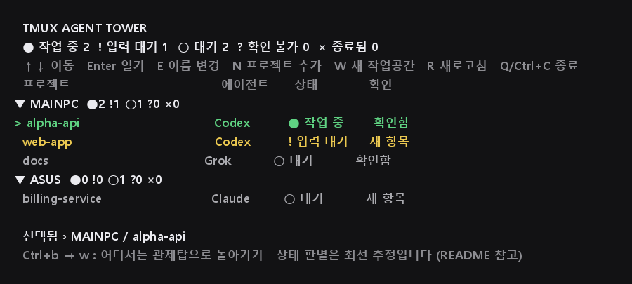

# Tmux Agent Tower

**[English](README.md) | 한국어**

tmux pane 여러 개에서 돌아가는 코딩 Agent들이 지금 뭘 하고 있는지 한눈에 봅니다.

Codex, Claude Code, OpenCode, Grok CLI, Cursor Agent CLI를 여러 tmux pane에서
(때로는 여러 대의 컴퓨터에 걸쳐) 동시에 쓰다 보면, 어떤 게 아직 작업 중인지,
어떤 게 승인을 기다리며 멈춰 있는지, 어떤 게 10분 전에 이미 끝났는지 놓치기
쉽습니다. Tmux Agent Tower는 이걸 한 화면에 모아 보여주고, 필요한 pane으로
바로 이동시켜주는 작고 local-first인 TUI입니다.



*(일반적인 예시 프로젝트 이름을 사용한 목업입니다)*

```
TMUX AGENT TOWER                                  MAINPC ● 2  ○ 1   ASUS ○ 1

── MAINPC ──────────────────────────────────────────────────────────────────
> ● alpha-api                                        Codex          작업 중
    Marketplace build
NEW ! web-app                                        Codex          입력 대기
  ○ docs                                             Grok           대기

── ASUS ────────────────────────────────────────────────────────────────────
  ● billing-service                                  Claude         작업 중

↑↓ 이동  Enter 열기  E 편집  N 추가  W 작업공간  / 검색  R 새로고침  Q 종료
```

## 이 도구는 이런 것입니다 (그리고 이런 것은 아닙니다)

* **Local-first**: 서버도, 계정도, 클라우드 백엔드도 없습니다. 사용자 본인의
  tmux 서버(그리고 선택적으로, 본인이 이미 맺어둔 SSH 연결을 통한 두 번째
  호스트)를 읽어서 보여줄 뿐입니다.
* **기본적으로 읽기 전용**: 모니터링 중인 pane에 키 입력을 보내지 않고,
  프로세스를 죽이거나 재시작하지 않으며, 실제 Agent CLI나 그 인증정보에는
  손대지 않습니다. tmux 상태를 읽고, Enter를 눌렀을 때 *사용자 본인의* 커서를
  pane 사이로 옮기는 것뿐입니다 -- `Ctrl+b` + 화살표키로 직접 하는 것과 같은 일입니다.
* **최선-추정(best-effort) 상태**이지 보장이 아닙니다. 상태는 각 Agent의
  내부 API가 아니라(대부분 그런 걸 제공하지 않습니다) 터미널 출력 패턴과
  프로세스 활동으로 추정합니다. Agent CLI의 새 버전이 나오면 UI가 바뀌어서
  해당 Agent의 감지가 깨질 수 있습니다 -- [`docs/STATUS_ENGINE.md`](docs/STATUS_ENGINE.md) 참고.

## 기능

* 호스트별로 묶어서, 넓은 표 대신 pane마다 압축된 행(프로젝트/에이전트/상태,
  그리고 프로젝트 이름이 말해주지 않는 걸 pane 제목이 알려줄 때만 두 번째
  줄)으로 한 화면에서 봅니다.
* "상태"와 "내가 이걸 봤는지"는 완전히 분리해서 추적합니다 -- 아직 열어보지
  않은 pane에서 Agent가 실제로 작업 중이면 어떤 모호한 "확인 중" 같은 게
  아니라 정확히 `작업 중`으로 표시됩니다. 안 열어본 pane에는 별도 컬럼이
  아니라 작은 `NEW` 표시만 붙고, 한 번 열어보면 그마저 사라집니다.
* 선택한 항목의 상세정보 패널(프로젝트/에이전트/Pane 이름/경로/상태/Host)이
  압축된 행에서 생략된 내용을 채워줍니다 -- 터미널이 낮으면 자동으로
  숨겨집니다.
* `/`로 목록을 실시간 필터링합니다(프로젝트/에이전트/제목/경로/Host 대상),
  `Esc`로 해제합니다.
* 프로젝트 이름은 실제 우선순위 체계로 자동 감지합니다: 직접 지정한 이름 →
  git 저장소 이름 → 의미 있는 pane 제목 → 디렉터리 이름 순이며, 의미 없는
  한 글자짜리나 마운트 포인트 같은 이름(`f`, `mnt` 등)은 더 나은 대안이
  있으면 그대로 보여주지 않습니다.
* 호스트별 요약은 개수가 0인 상태는 아예 숨겨서, `?0 ×0`처럼 일어나지도
  않은 상태까지 나열하지 않습니다.
* SSH로 연결된 두 번째 호스트도 함께 보여주며, 연결이 안 되면 `확인 불가`/오프라인으로
  안전하게 표시됩니다 -- 로컬 TUI는 그것 때문에 멈추지 않습니다.
* pane마다 한 줄짜리 **현재 작업** 추정치를 보여줍니다(예: `Calling
  some_tool...`, `~ Preparing write...`) -- 이미 캡처된 터미널 텍스트에서만
  뽑아내며, LLM 호출도 없고 외부로 나가는 것도 없습니다. 원본 터미널
  내용은 디스크에 저장하지 않습니다. 근거가 확실할 때만 보여주고,
  애매하면 그냥 숨깁니다.
* **상태 지속시간**: Tower가 이 pane을 현재 상태로 계속 관찰해 온 시간을
  보여줍니다(`대기 · 4m`), 상태 옆과 상세정보 패널에 함께 표시됩니다.
* **주의 필요 보기**(`A`)는 지금 당장 봐야 할 것부터 정렬합니다 --
  `입력 대기 > 확인 불가 > 종료됨 > 작업 중 > 대기` 순 -- 기본 호스트별
  순서는 건드리지 않으며, 다시 `A`를 누르면 원래대로 돌아갑니다.
* 기본적으로 꺼져 있는 알림 기능: 상태가 실제로 바뀔 때(예: Agent가 입력을
  기다리기 시작할 때) `notify-send` 또는(데스크톱 알림이 없는 환경이면)
  `tmux display-message`로 한 번만 알려줍니다 -- 같은 상태가 계속돼도
  반복해서 알리지 않습니다.

## 설치

Python 3.9+, tmux, curses를 지원하는 터미널(`TERM`)이 필요합니다(일반적인
터미널이면 다 됩니다).

```bash
git clone https://github.com/ju0o/tmux-agent-tower
cd tmux-agent-tower
./scripts/install.sh
```

설치 스크립트는:

* 사용자 계정에 `tower` 명령을 설치합니다(`pip install --user -e .`, 또는
  `--user` 설치가 막혀 있는 환경(PEP 668)이면 가상환경에 설치),
* `~/.bashrc`에 한 줄만 추가합니다(이미 있으면 건너뜁니다),
* 손대는 dotfile은 먼저 백업합니다(`<파일>.bak.<타임스탬프>`),
* `~/.tmux.conf`는 건드리지 않고, tmux 키도 기본적으로 재바인딩하지
  않습니다 -- 아래 "선택사항: `Ctrl+b w` 단축키" 참고.

설치한 걸 되돌리려면 `./scripts/uninstall.sh`를 실행하세요(뭘 되돌릴지 먼저
알려줍니다).

## 사용법

tmux pane 안 어디서든:

```
tower
```

를 치면 바로 그 pane에서 TUI가 실행됩니다. 나중에 다른 pane에서 또 하나
띄우면 그게 "현재 활성" Tower가 됩니다 -- 기존 것들도 안 죽고 계속
실행되지만, 아래의 `tower --focus`는 가장 최근 것으로 이동합니다.

Tower는 자신이 실행 중인 pane을 그 tmux 세션이 유지되는 동안 기억합니다
(창 이름이나 위치가 아니라 pane id 기준이라, 창 이름이 바뀌거나 다른
용도로 재사용돼도 헷갈리지 않습니다). 같은 세션의 다른 어디서든:

```
tower --focus
```

를 치면 새로 띄우지 않고 그 Tower로 바로 이동합니다. 아래의 선택적
`Ctrl+b w` 단축키가 하는 일이 바로 이것입니다 -- 또 다른 TUI를 띄우는 게
아니라 단순 이동 명령이라서 키에 바인딩해도 안전합니다.

| 키 | 동작 |
|---|---|
| `↑` / `↓` (또는 `j`/`k`) | 이동 |
| `Enter` | 선택한 pane으로 이동 |
| `E` | 선택한 pane의 프로젝트 이름/에이전트 이름/Pane 이름 편집 |
| `N` | 프로젝트 1개 추가 (Workspace Launcher, 단일) |
| `W` | 새 작업공간 시작 (Workspace Launcher, 다중) |
| `/` | 목록 실시간 필터링(프로젝트/에이전트/제목/경로/Host); `Esc`로 해제 |
| `A` | 주의 필요 보기 토글 (지금 봐야 할 것부터 정렬) |
| `R` | 즉시 새로고침 |
| `Q` / `Ctrl+C` | 종료 |

### 표시 내용 편집 (`E`)

자동 감지는 최선-추정이라 가끔 틀리거나 그냥 도움이 안 될 때가 있습니다
(드라이브 루트에서 바로 실행한 프로젝트는 글자 하나로 표시되기도 하고,
인식 못 한 에이전트는 `Shell`로만 보입니다). `E`를 누르면 선택한 행에 대해
작은 메뉴가 열립니다:

* **프로젝트 이름** -- 자동으로 찾은 프로젝트 이름을 대신합니다.
* **에이전트 이름** -- 화면에 표시되는 에이전트 이름을 바꿉니다. 알려진
  목록에서 고르거나 자유롭게 입력할 수 있습니다(예: `Gemini CLI`). 이건
  **표시용 metadata일 뿐**입니다 -- 실제 프로세스를 바꾸거나, 재시작하거나,
  뭔가를 보내지 않습니다. 그냥 그 행의 이름표만 바꿉니다.
* **Pane 이름** -- 실제 tmux pane title에도 최선을 다해 반영됩니다
  (`select-pane -T`); 이게 실패해도 Tower 나머지 기능에는 영향이 없습니다.
* **자동 감지로 복원** -- *이 pane만* 대상으로 세 가지 override를 모두
  지웁니다(전체 초기화가 아닙니다).

이렇게 지정한 내용은 새로고침해도 유지되고, pane별로 따로 저장되기 때문에
다음 자동 감지 결과가 여기서 고른 값을 덮어쓰지 않습니다.

### Workspace Launcher (`N` / `W`)

컴퓨터(호스트) 하나, 프로젝트 하나 이상(설정된 검색 경로에서 자동으로
찾거나, 검색하거나, 직접 경로 입력), 프로젝트별 에이전트를 고른 뒤 미리보기
화면(프로젝트별 에이전트 재지정, 레이아웃 선택 가능)을 보여주고, 확인하면
그 프로젝트들을 위한 **완전히 새로운** tmux pane을 만듭니다 -- 해당
프로젝트로 `cd`하고, 고른 에이전트를 실행하고, 제목을 자동으로 붙이고,
곧바로 Tower에 표시됩니다.

이건 이미 돌아가고 있는 Agent를 조작하는 것과는 분명히 다릅니다: 이
launcher는 항상 새 pane만 만들 뿐, 실행 전부터 있던 어떤 것에도 입력을
보내거나, 닫거나, 재구성하지 않습니다 -- 이 구분이 왜 중요한지, 그리고
아직 의도적으로 만들지 않은 것("Action Layer")이 무엇인지는
[`docs/ROADMAP.md`](docs/ROADMAP.md)를 참고하세요.

프로젝트 검색 위치는 `~/.config/tmux-agent-tower/config.toml`에서 옵니다:

```toml
project_roots = ["~/Projects", "~/code"]

[agents]
claude = "claude-beta"   # 에이전트 실행에 쓸 명령어를 직접 지정
```

둘 다 선택사항입니다 -- 설정이 전혀 없으면 launcher는 홈 폴더 아래에 실제로
있는 흔한 디렉터리 이름들(`Projects`, `code`, `dev`, `src` 등)을 찾고, 각
에이전트는 기본 명령어 이름을 씁니다. 실행 직전에 `command -v`로 명령어가
있는지 확인합니다(로컬 실행이면 로컬에서, 원격 실행이면 대상 호스트에서);
없으면 그 프로젝트의 pane만 "명령을 찾을 수 없음" 제목이 붙은 빈 셸로
열리고, 나머지는 정상적으로 진행됩니다.

### 선택사항: `Ctrl+b w` 단축키

`Ctrl+b w`를 활성 관제탑으로 바로 가는 단축키로 쓰면 편하지만, 이건 tmux
기본 `choose-tree` 창 선택 기능을 그 키에서 **덮어씁니다**. 설치
스크립트는 이걸 자동으로 하지 않습니다. 원하면 `~/.tmux.conf`에 직접
추가하세요:

```tmux
unbind-key w
bind-key w run-shell -b "tower --focus"
```

`tower`가 아니라 `--focus`라는 점에 주의하세요 -- 이 바인딩은 이미
실행 중인 Tower로 *이동*만 해야지, 백그라운드 키 입력에서 새 curses
TUI를 띄우면 안 됩니다(어디에도 제대로 붙을 곳이 없습니다).

### `tower --doctor`

환경을 빠르게 점검합니다(tmux/Python/curses 사용 가능 여부, tmux 안에서
실행 중인지, 설정된 원격 호스트 등)와 항목별 결과를 출력합니다.

### 두 번째 호스트

`~/.config/tmux-agent-tower/remote-hosts.txt`에, 이미 `~/.ssh/config`에
설정해둔 SSH alias를 한 줄 추가하세요:

```
asus:ASUS
```

그러면 Tower가 그 호스트의 pane들도 함께 보여줍니다(제목/명령어 기반
상태만 -- 아래 제한사항 참고), 로컬 호스트보다 새로고침 주기는 더 길고,
연결이 안 되면 `확인 불가`/오프라인으로 안전하게 표시됩니다. 원격
호스트에는 아무것도 설치되지 않습니다. Workspace Launcher(`N`/`W`)도 이
호스트를 대상으로 쓸 수 있습니다: SSH로 읽기 전용 `find`를 한 번 실행해서
그쪽의 git 저장소도 찾아주고, 아무것도 못 찾으면 마찬가지로 직접 경로
입력(`B`)으로 넘어갑니다.

### 언어

TUI는 맨 처음 실행할 때 딱 한 번 한국어/영어를 물어보고, 그 답을
`~/.config/tmux-agent-tower/config.toml`에 저장합니다(`language = "ko"` /
`"en"`). 이번 릴리스에는 앱 안에서 다시 바꾸는 기능은 없습니다 -- 바꾸고
싶으면 그 줄을 직접 수정하고 `tower`를 다시 실행하세요.

### 작업 인지 관련 설정

역시 `~/.config/tmux-agent-tower/config.toml`에서 설정하며, 전부
선택사항이고 기본값은 모두 조용한/보수적인 쪽입니다:

```toml
show_activity = true          # 기본값: true
show_status_duration = true   # 기본값: true
notifications = false         # 기본값: false -- 명시적으로 켜야 합니다

[notifications]
waiting = true   # 기본값: true (notifications = true일 때)
dead = false     # 기본값: false
```

`notifications = true`만으로 모든 알림이 켜지는 건 아닙니다 -- 전환 종류
(`waiting`, `dead`)마다 따로 켜고 끌 수 있고, 작업 중 → 대기 전환은 알림
종류로 아예 제공하지 않습니다: Tower는 pane 내용이 더 이상 바뀌지 않는다는
것만 알 뿐, 작업이 실제로 "끝났는지"는 알 수 없기 때문입니다.

## 지원 Agent

Codex, Claude Code, OpenCode, Grok CLI, Cursor Agent CLI, 그리고 그 외
전부를 위한 일반 shell/SSH 폴백. 모든 어댑터의 작업중/대기 판정(그리고
OpenCode를 제외한 입력대기 판정)은 실제로 그 CLI를 띄워 관찰한 뒤
만들어졌습니다 -- 각 어댑터가 정확히 어떤 근거를 보는지는
[`docs/STATUS_ENGINE.md`](docs/STATUS_ENGINE.md)를 참고하세요. OpenCode의
자체 승인/확인 프롬프트만은 실제로 관찰하지 못했습니다(테스트한 세션이
쓰기 작업을 자동 승인하는 설정이었습니다), 그래서 그 Agent의 입력대기
판정만 일반 패턴에 의존합니다 -- `adapters/opencode.py`의 설명 참고.
감지는 본질적으로 최선-추정이며 이 CLI들의 UI가 바뀌면 함께 낡아질 수
있습니다; 검증된(sanitize된) fixture와 함께 패턴을 고치는 PR을 환영합니다.

## 상태 의미

* `● 작업 중` -- 실제로 출력이 생기고 있거나 Agent 고유의 "작업 중" 신호가
  있습니다.
* `! 입력 대기` -- 사용자의 승인/입력을 기다리는 것으로 보입니다.
* `○ 대기` -- 살아있지만 대기 중인 건 없습니다.
* `? 확인 불가` -- 판단할 근거가 충분하지 않습니다. 이건 의도적으로 정직한
  fallback입니다 -- 왜 "모름"이 자신만만한 오답보다 나은지는
  `docs/STATUS_ENGINE.md` 참고.
* `× 종료됨` -- pane 또는 프로세스가 종료되었습니다.

방문 여부는 상태와 완전히 독립적입니다 -- Tower에서 그 pane을 한 번이라도
열어봤는지만 추적하며, 안 열어본 행 앞에 작은 `NEW` 표시만 붙습니다(열어본
행에는 아무것도 붙지 않습니다).

## 제한사항

* 상태 감지는 각 CLI의 *현재* 터미널 UI를 기준으로 한 패턴 매칭입니다.
  그 도구들이 바뀌면 낡아질 수 있습니다; 검증된 fixture와 함께 패턴을
  고치는 PR을 환영합니다.
* 원격/다중 호스트 화면은 pane 제목만 보고 실제 내용은 보지 않습니다(원격에
  아무것도 설치하지 않기 위한 의도적인 단순화 -- `docs/ARCHITECTURE.md`
  참고), 그래서 원격 상태는 로컬보다 거칠게 판단됩니다.
* `E`로 지정한 override(프로젝트/에이전트/제목)는 tmux의 pane id를 키로 삼는데, 이 id는 tmux 서버가
  재시작되면 재사용됩니다; 드물게 이전 이름이 엉뚱한 나중 pane에 "들러붙을"
  수 있습니다.
* Linux/WSL + tmux 환경에서 테스트했습니다. macOS도 (같은 Python + tmux +
  curses 조합이라) 대체로 동작할 것으로 보이지만 여기서 직접 검증하지는
  않았습니다.

## 제거

```bash
./scripts/uninstall.sh
```

## 로드맵

[`docs/ROADMAP.md`](docs/ROADMAP.md) 참고. Agent에 입력을 보내거나,
중단/재시작시키거나, 승인 프롬프트를 자동으로 처리하는 기능은 분명히
**구현하지 않았고**, 별도의 신중한 설계 검토 없이는 계획에도 없습니다 --
이 도구는 항상 읽고 이동만 시켜줍니다.

## 라이선스

MIT -- [`LICENSE`](LICENSE) 참고.
